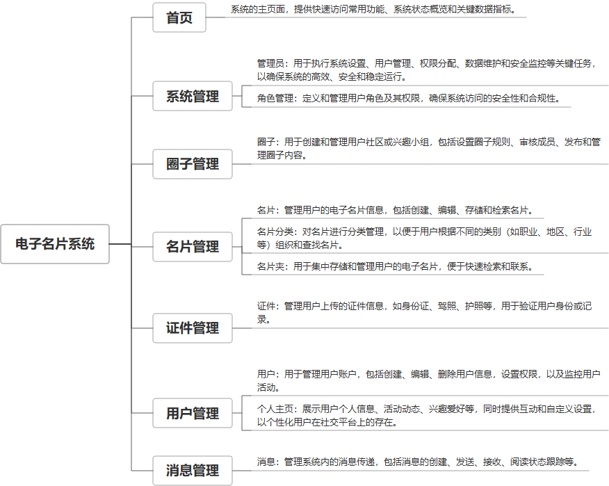

 

    
 

公司拥有上百套具有自主知识产权的软件系统，详情请查看码云首页或公司官网

 
<h1>电子名片系统</h1>

<a href="https://www.haishi.net.cn/">公司官网</a> ｜ <a href="https://www.haishi.net.cn/">在线体验</a>

 

## 系统介绍

名片分享、互动管理、名片访问记录等
名片分享、互动管理、名片访问记录等
本项目名称为电子名片系统，旨在实现电子名片的创建、管理和分享，以及用户之间的联系方式交换和互动。该系统主要包括名片管理、名片夹、消息管理、用户管理、角色管理、权限管理、圈子管理、证件管理等模块。
本项目从用户层面可以分为两个端：管理端、用户端。
- 管理端：管理员用户使用，可以进行用户管理、角色管理、权限管理、圈子管理、证件管理等
- 用户端：用户使用，可以创建、编辑、管理和分享电子名片，以及查看他人名片、交换联系方式、发送消息等
                

## 系统功能介绍

### 系统包含终端说明

管理端（WEB）、用户端（微信小程序）

| 序号 | 模块               | 模块说明 |
| ---- | ------------------ | -------- |
| 1    | QHY-ZNMP-MP-MANAGE | 管理端   |
| 2    | QHY-ZNMP-MP-APP    | APP      |
| 3    | QHY-ZNMP-MP-MP     | 小程序   |
| 4    | QHY-ZNMP-MP-SERVER | 服务端   |

### 系统功能结构

### 系统功能说明

名片管理、名片夹、消息管理

## 系统主要界面

## 系统技术说明

### 代码模块说明

| 序号 | 目录                                      | 目录说明 |
| ---- | ----------------------------------------- | -------- |
| 1    | QHY-ZNMP-MP-SERVER/px-unimall-launcher    | --       |
| 2    | QHY-ZNMP-MP-SERVER/px-unimall-app-api     | --       |
| 3    | QHY-ZNMP-MP-SERVER/px-unimall-core        | --       |
| 4    | QHY-ZNMP-MP-SERVER/px-unimall-biz         | --       |
| 5    | QHY-ZNMP-MP-SERVER/px-unimall-data        | --       |
| 6    | QHY-ZNMP-MP-SERVER/px-unimall-admin-api   | --       |
| 7    | QHY-ZNMP-MP-SERVER/px-unimall-plugin-core | --       |
| 8    | QHY-ZNMP-MP-SERVER/.idea                  | --       |

### 系统技术选型

#### 开发语言/框架

JAVA（JDK1.8）
前端框架：VUE2
前端框架：uni-app
框架：SpringBoot2.x
系统结构：单体应用

#### 服务中间件

Nginx
Tomcat

#### 数据库

MySQL（5.7+）

#### 其他说明

无

## 系统演示/商用

请扫码添加客服微信获取演示地址和系统详细资料。

如果您想基于电子名片系统进行商业化交付或定制开发服务，我们提供有偿的技术服务支持，合作模式不限，欢迎沟通！

公司官网地址： <a href="https://www.haishi.net.cn/">https://www.haishi.net.cn</a>

联系客服获取专业回答。

## 使用须知

1、 本项目商用必须获得版权所有者的授权。

2、 未经允许本项目代码不允许二次出售。

